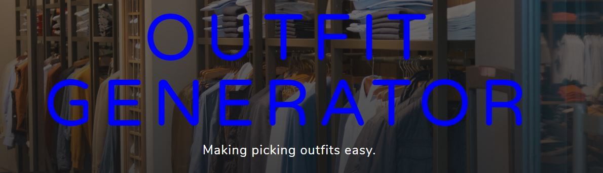
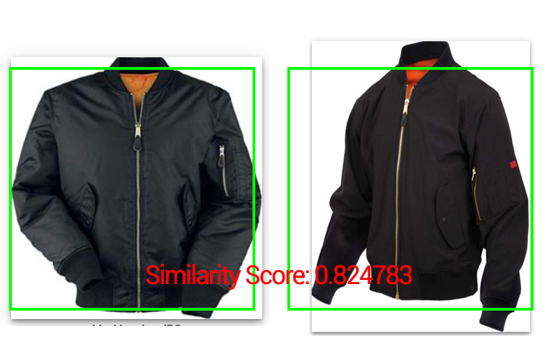
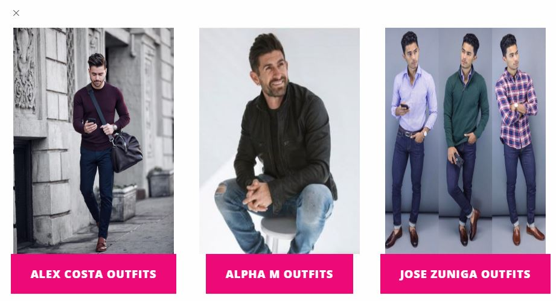
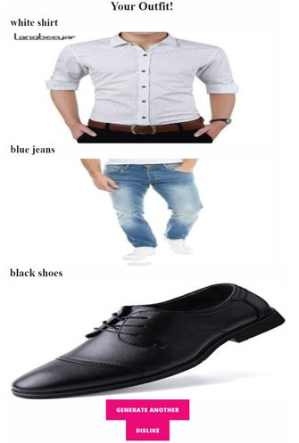

   
  

# OutfitGenerator
Generates outfits based on your wardrobe, and style preferences.

# How it works
<ul>
  <li> Users are authenticated with Django's built in user authentication </li>
  <li> When a user registers, a product set is created for the Google Vision API, this product set will store all the clothing items a user adds </li>
  <li> To add a clothing item, a user must provide a name, category and image for the item, this clothing item is then added to the product set </li>
  <li> User is given the option of choosing from 3 style preferences </li>
  <li> Each style preference consists of many clothing items determined by clothing items viewed on each style preferences youtube channel. These clothing items make up the outfits that our program will try to replicate with the users personal wardrobe. </li>
  <li> The google vision api then iterates through each of these outfits, and compares the clothing items from the desired outfits to all of the clothing items in the users wardrobe, and selects clothes with the highest similarity score. This then generates the outfit </li>
  <lI> If the user does not like the outfit, they can simply select "dislike", the outfit is then added to a bad outfits model, so that the outfit is not generated in the future </li>
  <li>
    
   </li>
</ul>

# Screenshots

   
  <h5> Choosing Style Preferences </h5>
  
  <h5> Outfit Generated from Wardrobe </h5>
  

# Try it yourself
- The Web application is currently local, will be deployed soon.
